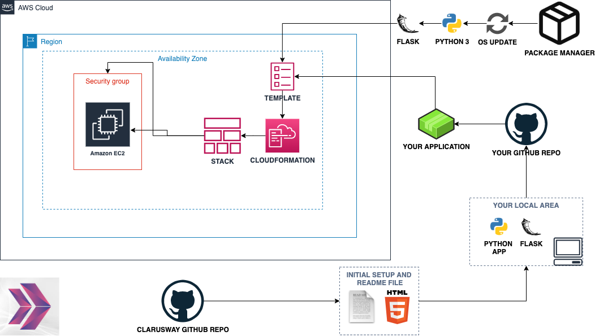
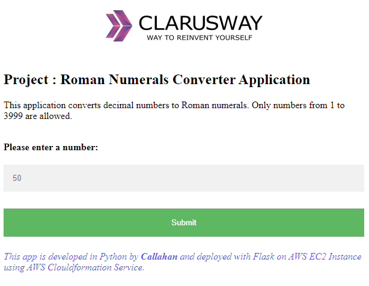

# Roman Numerals Converter App (Python Flask) deployed on AWS EC2 with Cloudformation and AWS CLI
## Description
The Roman Numerals Converter Application aims to convert the given number to the Roman numerals. The application is to be coded in Python and deployed as a web application with Flask on AWS Elastic Compute Cloud (EC2) Instance using AWS Cloudformation and CLI Services. 

## Problem Statement


- Your company has recently started a project that aims to be one of the most used unit converters and formulas websites. Roman Numerals Converter is part of the project. So you and your colleagues have started to work on the project.

- As a first step of the project, developers wrote a basic Python Flask program that converts the given number (between 1 and 3999) to the Roman numerals. The program converts only from numbers to Roman numerals, not vice versa, and during the conversion following notes should be taken into consideration.
   
```
Roman numerals are represented by seven different symbols: I, V, X, L, C, D and M.
- Symbol       Value
- I             1
- V             5
- X             10
- L             50
- C             100
- D             500
- M             1000
- For example, two is written as II in Roman numeral, just two ones added together. 
Twelve is written as, XII, which is simply X + II. 
The number twenty-seven is written as XXVII, which is XX + V + II.
- Roman numerals are usually written largest to smallest from left to right. 
However, the numeral for four is not IIII. Instead, the number four is written as IV. 
Because the one is before the five we subtract it making four. 
The same principle applies to the number nine, which is written as IX. 
There are six instances where subtraction is used:
- I can be placed before V (5) and X (10) to make 4 and 9. 
- X can be placed before L (50) and C (100) to make 40 and 90. 
- C can be placed before D (500) and M (1000) to make 400 and 900.
```

- User input can be either integer or string, thus the input is checked for the followings,

   - The input should be a decimal number within the range of 1 to 3999, inclusively.
   
   - If the input is less than 1 or greater than 3999, the program warns the user using the given HTML template.

   - If the input is a string and can not be converted to a decimal number, the program warns the user using the given HTML template.

- Example for user inputs and respective outputs

```
Input       Output
-----       ------
3           III
9           IX
58          LVIII
1994        MCMXCIV
-8          Warning with "Not Valid! Please enter a number between 1 and 3999, inclusively."
4500        Warning with "Not Valid! Please enter a number between 1 and 3999, inclusively."
Ten         Warning with "Not Valid! Please enter a number between 1 and 3999, inclusively."
```
   
- As a DevOps, developer has given you app and template folder, you are requested to deploy your web environment using Python's Flask framework.

- You are requested to push your program to the project repository on the Github and deploy your solution in the development environment on AWS EC2 Instance using AWS Cloudformation Service to showcase your project. In the development environment, you'll configure your Cloudformation template using the followings,

   - The application stack should be created with new AWS resources. 

   - The application stack should take the name of your Key Pair as a parameter from the user;
   
   - The application should run on Amazon Linux 2 EC2 Instance

   - EC2 Instance type can be configured as `t2.micro`.

   - Latest AWS Linux AMI should be used for template.

   - Instance launched by Cloudformation should be tagged `Web Server of StackName` 

   - The Web Application should be accessible via web browser and terminal from anywhere.

   - The Application files should be downloaded from Github repo and deployed on EC2 Instance using user data script within cloudformation template. 

   - Roman Numerals Converter Application Website URL should be given as output by Cloudformation Service, after the stack created.

- Lastly, try to deploy same infrastructure using AWS CLI commands to showcase your project. 

## Project Skeleton 

```
001-roman-numerals-converter (folder)
|----cli.sh            # To be delivered by students (CLI commands)
|----readme.md         # Given to the students (Definition of the project)          
|----cfn-template.yml  # To be delivered by students (Cloudformation template)
|----app.py            # Given to the students (Definition of the project)          
|----templates
        |----index.html  # Given to the students (HTML template)
        |----result.html # Given to the students (HTML template)
```

## Expected Outcome



### At the end of the project, following topics are to be covered;

- Algorithm design

- Programming with Python 

- Web application programming with Python Flask Framework 

- Bash scripting

- AWS EC2 Service

- AWS Security Groups Configuration

- AWS Cloudformation Service

- AWS Cloudformation Template Design

- AWS CLI Service

- AWS CLI commands, filters and queries

- Git & Github for Version Control System

### At the end of the project, students will be able to;

- improve coding skills using iterables(dict), operators, for-loop, if statements and functions within Python

- improve web programming skills using HTTP GET/POST methods, template formatting, importing packages within Python Flask Framework

- improve bash scripting skills using `user data` section in Cloudformation to install and setup web application on EC2 Instance

- configure AWS EC2 Instance and Security Groups.

- configure Cloudformation template to use AWS Resources.

- use AWS Cloudformation Service to launch stacks.

- use AWS Cli to launch same stacks.

- use git commands (push, pull, commit, add etc.) and Github as Version Control System.

## Steps to Solution
  
- Step 1: Download or clone project definition from `clarusway-aws-workshop` repo on Github 

- Step 2: Create project folder for local public repo on your pc

- Step 3: Copy the Roman Numerals Converter Application in Python

- Step 4: Prepare a cloudformation template to deploy your app on EC2 Instance

- Step 5: Push your application into your own public repo on Github

- Step 6: Deploy your application on AWS Cloud using Cloudformation template to showcase your app within your team.

- Step 7: Deploy your application on AWS Cloud using AWS Cli to showcase your app within your team.

## Notes

- Customize the application by hard-coding your name for the `developer_name` variable within html templates.

## Resources

- [Python Flask Framework](https://flask.palletsprojects.com/en/1.1.x/quickstart/)

- [Python Flask Example](https://realpython.com/flask-by-example-part-1-project-setup/)

- [AWS Cloudformation User Guide](https://docs.aws.amazon.com/AWSCloudFormation/latest/UserGuide/Welcome.html)

- [AWS Cli User Guide](https://docs.aws.amazon.com/cli/latest/)
